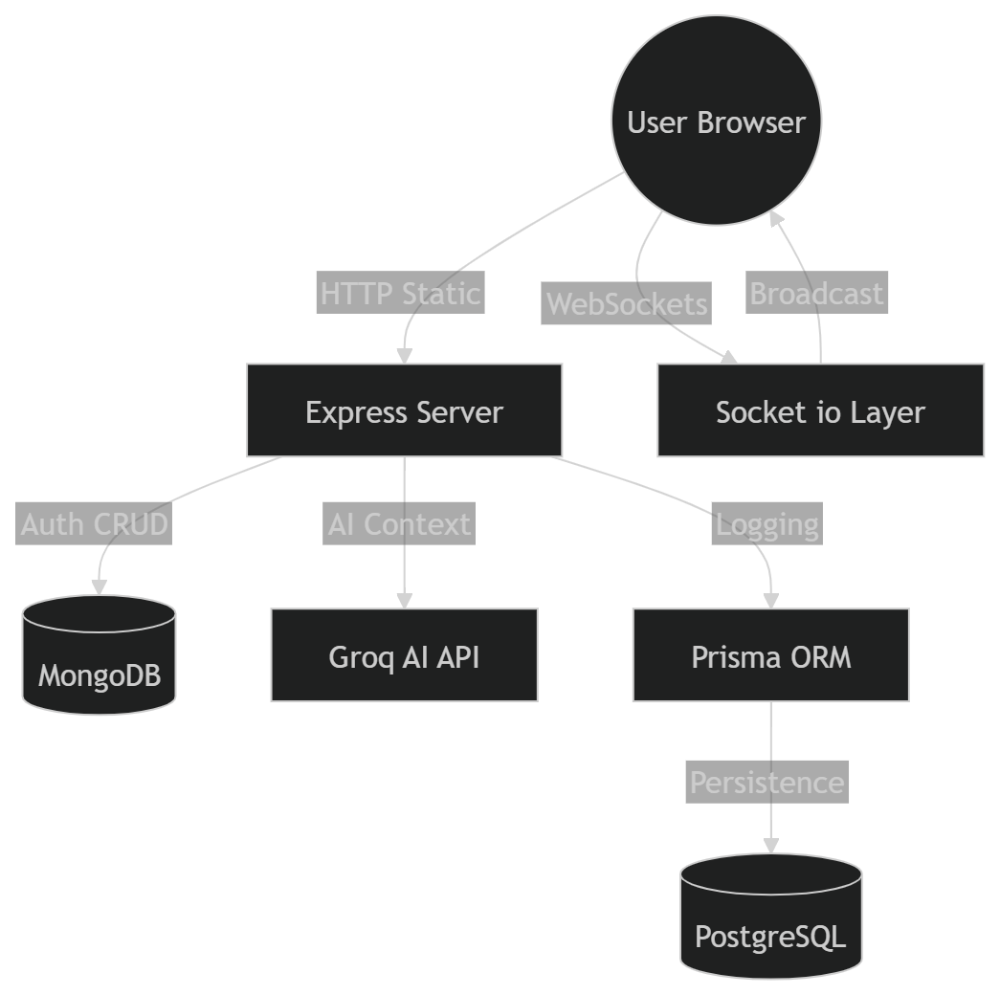
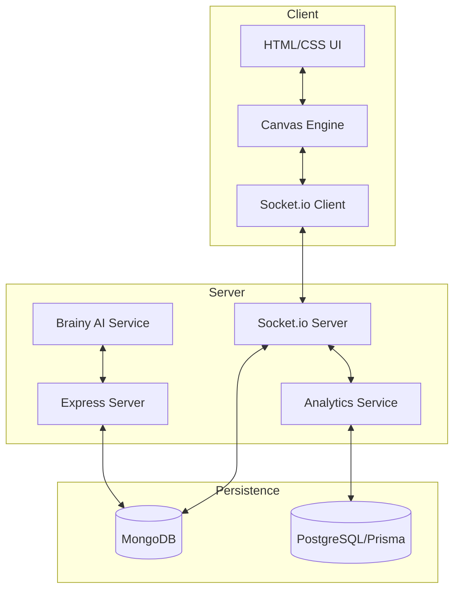

# System Architecture

This document provides a deep dive into the technical architecture of Slateboard.

## High-Level Architecture

Slateboard utilizes a decoupled, event-driven architecture designed for low-latency real-time collaboration.

### Architecture Diagram

## Data Flow & Synchronization

### 1. Real-time Drawing Flow
1.  **Start**: User clicks the canvas. The `CanvasEngine` creates a `draftStroke`. `stroke:start` is emitted via Sockets.
2.  **Streaming**: As the user moves the mouse, points are added to the `draftStroke` and emitted as `stroke:point` events.
3.  **Broadcast**: The server receives `stroke:point` and immediately broadcasts it to all other users in the same room namespace.
4.  **End**: User releases the mouse. `stroke:end` is emitted. The server validates the full stroke and persists it to **MongoDB**.
5.  **Audit**: Simultaneously, the server logs the stroke creation event to **PostgreSQL** via Prisma for audit tracking.

### 2. AI Assistant (Brainy)
- **Request**: User sends a query.
- **Context Gathering**: The server fetches the current board state (tools, text, stroke counts) and user profile.
- **Processing**: The context + query are sent to the **Groq API** with a strict academic-focused system prompt.
- **Response**: The AI result is returned to the user and logged in the analytics database.

## Database Strategy (Hybrid)

| Database | Technology | Purpose |
| --- | --- | --- |
| **Document Store** | MongoDB | Stores complex, nested data like Boards, Strokes, and Users. Optimized for fast retrieval of the entire board state. |
| **Relational Store** | PostgreSQL | Stores structured logs, activity trails, and session metrics. Optimized for analytical queries and audit compliance. |

## Network Layer

- **HTTP**: Used for authentication, board listing, and metadata management.
- **WebSockets (Socket.io)**: Used for all real-time canvas data and chat messages.
- **Rate Limiting**: Applied at both the HTTP and WebSocket layers to ensure system stability.
